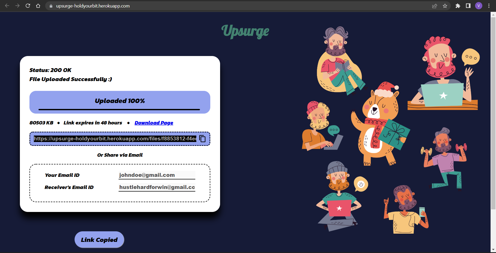
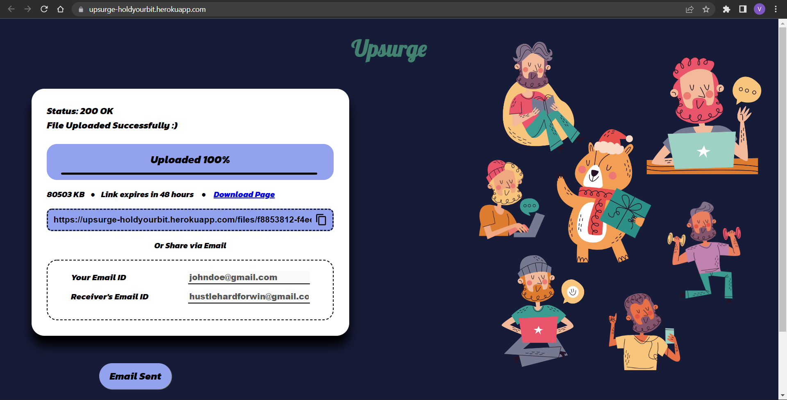
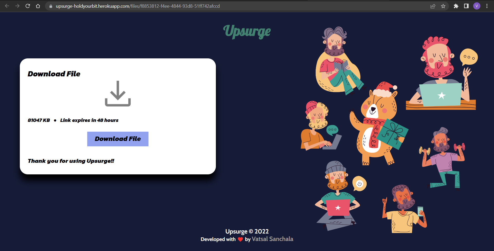

<div align="center">
  

  <h3 align="center">Upsurge | Hold Your Bit</h3>

  <p align="center">
    <strong>Developed with ❤️ by Vatsal Sanchala</strong><br>
    <br />
    <br />
    <a href="https://upsurge-holdyourbit.herokuapp.com/">Upsurge</a>

  </p>
</div>

## About The Project
Upsurge is a Quick File Sharing Web App where Files under 100 MB can be uploaded after which you get a Download Link. You can also share the resource Link through Email by adding you Email ID and Receiver's Email ID. Receiver gets an Email with Download Page Link and File Information. Using Download Page, you can download the File anywhere anytime within 48 hours of uploading since the Download Link epxires after 48 hours.

### Tech. Store
* [![Node.js][Node.js]][Node-url]
* [![Express][Express.js]][Express-url]
* [![MongoDB][Mongo.db]][Mongo-url]

<br>

## Initial Setup

### Prerequisites

* npm
  ```sh
  npm install npm@latest -g
  ```
* yarn
  ```sh
  npm install yarn
  ```

### Installation

1. Clone the Repository
   ```sh
   git clone https://github.com/bevatsal1122/Upsurge.git
   ```
2. Install YARN Packages
   ```sh
   yarn init
   ```
3. Configure `.env` File
   ```js
    PORT = 5000
    DEVELOPER_MODE = true
    DB = "<YourMongoDBClusterConnectionLink>"
    HOST = http://localhost:5000
    SMTP_SERVER = <SMTP-Server>
    SMTP_PORT = <SMTP-Port>
    SMTP_AUTH_LOGIN = <SMTP-Login>
    SMTP_AUTH_PASS = <SMTP-Master_Password>
   ```

## Interface






#### * Suitable for Viewing on all Media Devices 

## Roadmap

* Enable CORS Policy if requesing from other Domain URL
  > Install cors Package
  ```sh
    yarn add cors
  ```
  <br>
  
  * Update server.js
  ```js
    const cors = require('cors');
    app.use(cors());
  ```
  <br>
  
* Run server.js File
  <br>
  
  > Developement Mode
  ```sh
    yarn dev
  ```
  <br>
  
  > Production Mode
    * Update .env File
    ```js
      DEVELOPER_MODE = false
    ```
    ```sh
      yarn prod
    ```

## Contact

[Vatsal Sanchala](https://www.linkedin.com/in/bevatsal1122/) - bevatsal1122@gmail.com

Project Link: https://github.com/bevatsal1122/Upsurge

Deployment Link: https://upsurge-holdyourbit.herokuapp.com

[Node.js]: https://img.shields.io/badge/Node.js-35495E?style=for-the-badge&logo=nodedotjs&logoColor=4FC08D
[Node-url]: https://nodejs.org/en/
[Express.js]: https://img.shields.io/badge/Express-38352A?style=for-the-badge&logo=express&logoColor=4FC08D
[Express-url]: https://expressjs.com/
[Mongo.db]: https://img.shields.io/badge/MongoDB-DD0031?style=for-the-badge&logo=mongodb&logoColor=green
[Mongo-url]: https://www.mongodb.com/
